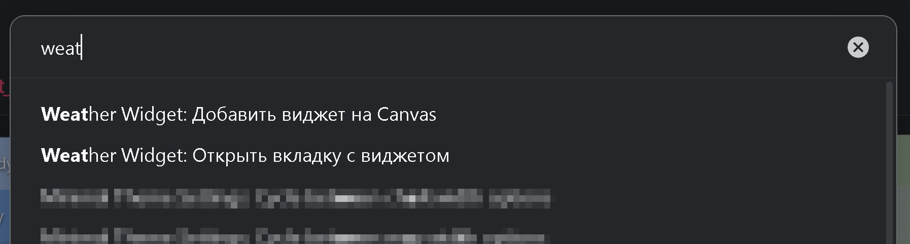

# Weather Widget for Obsidian

<table>
<tr>
<td width="60%" valign="top">

<div align="center">


<figcaption>Example of plugin settings (minimal, soft, no presets)</figcaption>

---

**English** | [**Русский**](./README.ru.md)

</div>

</td>
<td width="40%" valign="top">

### Quick navigation
- [Key Features](#key-features)
- [Installation](#installation)
- [Usage](#usage)
- [Command Palette](#command-palette)
- [Settings Reference](#settings-reference)
---

<p align="center">
If you like the plugin as much as I do, you can always show your appreciation!
  <br>
  <a href="https://buymeacoffee.com/mr.asa" target="_blank">
  
  </a>
</p>

---

</td>
</tr>
</table>

<details>
<summary>Why this plugin exists</summary>

Keeping in touch with friends and family scattered across the globe usually means checking several cities in a weather app, adjusting for time zones, and mentally comparing temperatures. I wanted a single glance overview that also looked at home in Obsidian. The first iteration was a quickly hacked DataviewJS snippet, but maintaining the markup, color tokens, and gradients turned into a time sink.

This project grew from that experiment: a configurable widget that renders the same layout in the sidebar, Markdown notes, and Canvas while keeping gradients, icons, and transitions perfectly aligned with my vault theme. GPT was a big help in the early scaffolding stage, the rest evolved from daily use.

</details>

---

**Weather Widget** brings a live multi-city forecast directly into Obsidian. The widget mirrors the visual style of your vault, renders in the right sidebar, Markdown notes, and Canvas nodes, and exposes all gradients, icons, and sun overlays for fine-tuning. Inline cities declared inside a code block merge with the global list without duplicates, so every note can show the exact mix you need.

## Key Features

- Multi-city layout with automatic time zone offsets, sunrise/sunset easing, and temperature-driven gradients.
- Command palette shortcuts for opening the view or inserting a Canvas node.
- Works everywhere: dedicated sidebar view, inline Markdown blocks, and Canvas nodes.
- Two weather providers (Open-Meteo by default, OpenWeather – requires a free API key) with caching to stay inside rate limits.
- Deep appearance controls: swap any icons, palettes, sun overlay behaviour, and layered gradients with live preview.
- Localisation for English and Russian.

## Installation

### From Obsidian (when published)

<details>
<summary>You will be able to install directly once the plugin is in the community catalogue</summary>

- Open *Settings → Community plugins*
- Click **Browse**
- Search for “Weather Widget”
- Install and enable the plugin

</details>

### Manual installation

1. Download `main.js`, `manifest.json`, and `styles.css` from the latest release.
2. Copy the files into `<vault>/.obsidian/plugins/weather-widget`.
3. Enable **Weather Widget** under *Settings → Community plugins*.

## Usage

- Launch the sidebar widget with **Weather Widget: Open tab** or by opening the registered view from the right sidebar.
- Insert a Canvas node via **Weather Widget: Insert Canvas node** – it drops a ready-to-configure Markdown block.
- Configure everything in *Settings → Weather Widget*. Changes apply instantly to every rendered widget.
- Add per-note cities inside a Markdown block. Each non-empty line must follow `"City name" <latitude> <longitude>` (quotes required, whitespace-separated, **no commas**). Inline entries merge with your saved list without duplicates.

Minimal block:

````markdown
```weather-widget
````

With inline cities and custom row height:

````markdown
```weather-widget
row-height: 24
"Mossingen" 48.406635032  9.057441152
"Wuhan"     30.59543      114.29987
```
````

`row-height` accepts pixel values (24–200). Omit it to use the global default (~36 px).

## Command Palette



- `Weather Widget: Open tab` – focus the live widget view (right sidebar by default).
- `Weather Widget: Insert Canvas node` – create a Canvas text node with the Markdown placeholder.

## Settings Reference

### Localisation
- Switch between English and Russian without reloading the vault. City names remain untouched.

### Weather updates
- Pick a data provider: **Open-Meteo** (no key) or **OpenWeather** (requires free API key). Switching providers refreshes the cached data.

### Locations
- Maintain the global city list. Every row lets you set name, latitude, longitude, re-ordering, or deletion.

> [!note]
> Any characters and languages are accepted. Custom display names make it easy to compare “Summit”, “Beach house”, or any personal label. For example, I track a nearby mountain and the city below; naming the exact coordinates through standard providers is tricky, so custom names help.

### Preview playground
- The preview widget mirrors the real component. Sliders simulate local time and temperature, the dropdown swaps weather categories.

> [!note]
> Use ←/→ or ↑/↓ to nudge slider values one step at a time.

### Time-of-day palette
- Choose base colors for morning, day, evening, and night.
- Replace the time-of-day icons if you prefer custom symbols (for example: ◑ ◉ ◐ ⨀).
- Define how many minutes before sunrise/sunset blending should start and end.

### Sun layer
- Customize colors for day/night/sunrise/sunset and the symbol used for the sun.
- Select an alpha curve profile to control how the sun gradient fades in/out.


- Configure gradient width, opaque core, opacity multiplier, overflow, and icon behaviour (regular vs monospaced font).
- Tune sunrise/sunset transition windows similar to the time-of-day palette.

> [!note]
>I introduced the sun symbol to represent the height of the sun above the horizon.
You can choose any text character or combination of characters for the sun icon.
The main rule for proper display is that the symbol should be centered on the line.
Here are some examples of possible symbols:
> 
> ◯⨀○৹●•·◎◉\
> ▣◇◆▪▫\
> \- – —\
> ►◄▻◅▸◂▹◃\
> ⋯Θ⊢⊣
> 
> For example, you can use the symbol ◯ to create a large ring, or enable a monospaced font and write —•— for a clean indication of height (But I like the variant ——●—— with size of 0.5).
You can also disable the icon entirely, leaving only the color accent.

### Weather layer
- Set icon and colour per weather category.
- Adjust alpha profile, inner opacity ratio, overall opacity, and left fade.

### Temperature layer
- Manage temperature-to-colour stops, add/remove entries, and configure the alpha profile similar to the weather layer.

### Additional options
- **Edge gradient width** – global scaling factor for weather and temperature layers. Use smaller values when you prefer solid day/night backgrounds.

> [!note]
> Weather and temperature transitions can differ in perceived width for each city. This is deliberate: daylight length is reflected in the gradient span. Compressing both layers to the same width would hide that variance.

- **Row height limits** – define minimum and maximum heights. Widgets respect these bounds when a block or setting requests a taller/shorter row.

---

If you spot issues, have ideas for new gradients, or want to share a theme setup, feel free to open an issue or start a discussion. Happy forecasting!
