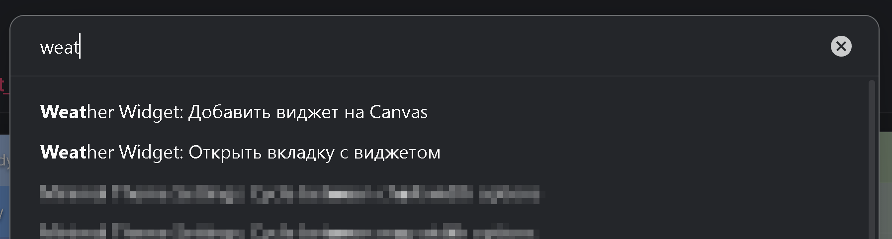

# Weather Widget для Obsidian

<table>
<tr>
<td width="60%" valign="top">

<div align="center">


<figcaption>
Пример настоек плагина (minimal, soft, no presets)

Пресеты настроек лежат в папке *presets* репозитория, любой можно скопировать в настройки плагина и удалить первое слово перед точкой. Должно получиться имя `data.json`
</figcaption>

---

[**English**](./README.md) | **Русский**

</div>

</td>
<td width="40%" valign="top">

### 📚 Навигация
- [Ключевые возможности](#ключевые-возможности)
- [Установка](#установка)
- [Использование](#использование)
- [Команды для Ctrl+P](#команды-для-ctrl+p)
- [Справочник по настройкам](#справочник-по-настройкам)
---

<p align="center">
  Если плагин кому-то понравится не меньше, чем мне самому, Вы всегда можете поблагодарить!
  <br>
  <a href="https://buymeacoffee.com/mr.asa" target="_blank">
  
  </a>
</p>


</td>
</tr>
</table>

<details>
<summary>Причина создания</summary>

Главной целью создания данного плагина было желание быстрым взглядом примерно понять какое время и погода в тех городах, где живут друзья или родственники.

Сначала я сделал большой dataviewjs скрипт. Он мне понравился, но как говорится, лучшее - враг хорошего. Я начал пытаться сделать его чуть красивее, чем получился на тот момент (мне он казался серым и мрачным) и понял, что подбирать HEX коды цветов для каждого градиента, а так же процент заполнения им общей строки - это очень утомительно и неэффективно.

А потом подумал, что не я один такой, кому может захотеться поставить погоду себе в канвас или на стартовой странице. Но подобных решений в репозитории плагинов на первый взгляд я не нашел.

Ну я и начал пытать GPT с этим виджетом =)

</details>

---

**Weather Widget** добавляет в Obsidian погодную ленту для нескольких городов с гибкими настройками визуализации. Виджет одинаково рендерится в отдельной панели, в Markdown-заметках и в Canvas, а также позволяет настроить градиенты, иконки и солнечную индикацию. Кроме глобального списка городов, локации можно дополнительно подключать прямо внутри Markdown-блока.

## Ключевые возможности

- Несколько городов в одном списке: автоматический учёт часовых поясов, плавные переходы рассвет/закат, температурные градиенты.
- Команды палитры для быстрого открытия вкладки с виджетом или добавления заготовки на Canvas.
- Работает везде: отдельная вкладка в боковой панели, Markdown-блоки в заметках или узлы Canvas.
- Два источника данных на выбор (Open-Meteo по умолчанию и OpenWeather (нужен бесплатный API ключ)).
- Гибкая настройка внешнего вида: возможность сменить любые иконки, палитры, параметры солнечного слоя, кривые градиентов с интерактивным предпросмотром.
- Локализация интерфейса (английский и русский).

## Установка

### Из каталога Obsidian (когда опубликуется)

<details>
<summary>Вы сможете активировать плагин напрямую из Obsidian, когда он появится в каталоге</summary>

- Откройте *Settings -> Community plugins*
- Нажмите **Browse**
- Найдите «Weather Widget»
- Установите и включите

</details>

### Ручная установка

<table>
<tr>
<td valign="top" width="50%">

#### Через релиз
- Скачайте `main.js`, `manifest.json`, `styles.css` из [последнего релиза](https://github.com/mr-asa/obsidian_weather/releases) и поместите их в папку `<vault>/.obsidian/plugins/weather-widget`.
- Включите **Weather Widget** в *Settings -> Community plugins.*

</td>
<td valign="top" width="50%">

#### BRAT плагин

- Откройте *Settings -> Community plugins*, Нажмите *Browse*, Найдите [**«BRAT» плагин**](https://obsidian.md/plugins?id=obsidian42-brat), установите, активируйте.
- В настройках плагина **BRAT** нажмите кнопку **Add beta plugin**, вставьте в поле Repository путь к [этому репозиторию](https://github.com/mr-asa/obsidian_weather), далее выбрать *Select a version -> Latest version*, кнопка **Add Plugin**
- Готово. Плагин установлен и активирован.

</td>
</tr>
</table>

## Использование

- Откройте виджет в боковой панели через команду **Weather Widget: Open tab**
- Добавьте заготовку на Canvas командой **Weather Widget: Insert Canvas node** — на активный холст упадёт текстовый узел с готовым кодовым блоком.
- В любом ноуте можно просто вставить строку ` ```weather-widget` и на этом месте будет отрисовываться виджет погоды.
- Настройте параметры в *Settings -> Weather Widget* — все изменения применяются сразу.

> [!TIP]
> Добавляйте дополнительные города прямо в Markdown-блок: каждая непустая строка должна соответствовать шаблону `"Название" <широта> <долгота>` (кавычки обязательны, название может содержать любые символы, в том числе и пробелы. Значения самой строки разделяются пробелами, **без запятых**).
> 
> Встроенные города объединяются с глобальным списком без дублирования, поэтому можно отображать как просто локальные записи или глобальные, так и комбинировать оба списка в одном виджете.
> 
> Минимальный блок выглядит так:
> ~~~markdown
> ```weather-widget
> ~~~
> Блок с локальными городами и переопределённой высотой строки:
> ~~~markdown
> ```weather-widget
> row-height: 24
> "Mossingen" 48.406635031986724  9.057441152479019
> "Uhan City" 30.59543            114.29987
> ```
> ~~~
> - `row-height` принимает значение в пикселях и действует только в текущем блоке.
> - Высота строки по умолчанию ~36 px и может изменяться в пределах 24–200 px.

## Команды для Ctrl+P



- **Weather Widget: Open tab** — открывает отдельный виджет (по умолчанию в правой панели).
- **Weather Widget: Insert Canvas node** — добавляет на Canvas текстовый узел с минимальной Markdown-заготовкой.

## Справочник по настройкам

### Локализация

Переключает интерфейс между английским и русским языками. Наименования городов при этом не изменяются.

### Обновление погоды

- Доступно два поставщика данных: Open-Meteo и OpenWeather.
  - Open-Meteo не требует ключа.
  - OpenWeather использует бесплатный API-ключ аккаунта.

> [!TIP]
> - Если при запуске плагина не по всем городам подгрузились данные и некоторые строки остались серыми - в настройках можно переключиться между источниками данных туда-сюда для обновления кэша. Все отрисуется полностью.


### Локации
- Глобальный список городов, который будет выводиться в любом созданном виджете.
- Задайте название, широту и долготу, меняйте порядок, удаляйте ненужные записи.

> [!note]
> Названия можно вводить на любом языке, использовать символы и эмодзи.
> 
> Кастомные имена для координат сделаны специально для удобства.\
> Например, можно сравнивать температуру у подножия и на вершине горы, даже если официального топонима для координат нет.

### Строка предпросмотра

Повторяет реальный виджет и обновляется при каждом изменении настроек. Слайдеры имитируют локальное время и температуру, выпадающий список переключает погодные условия.

> [!note]
> Тонкие правки удобно вносить стрелками клавиатуры (←/→ , или ↑/↓ ).

### Палитра времени 

- Задайте базовые цвета для утра, дня, вечера и ночи.
- Так же можно заменить стандартные эмотиконы. Например в минималистичном стиле ◑◉◐⨀
- Установите, за сколько минут до и после восхода/заката начинается соответствующий цветовой переход.

### Солнечный слой

- Настройте поведение солнца:
- Цвета ночи, рассвета, дня и заката.
- Профиль прозрачности (подберите форму кривой под тему: от резкого пика до «пузыря»).

- Дополнительно отрегулируйте ширину градиента и коэффициент непрозрачности.
- Подберите символ солнца, масштаб и тип шрифта (моноширинный или обычный).

> [!note]
> Символ солнца я ввел для обозначения высоты солнца над горизонтом.\
> Для значка солнца можно выбрать любой текстовый символ или их сочетание. Главное правило для правильного отображения - символ должен быть по центру строки. Вот несколько вариантов значков:
> 
> ◯⨀○৹●•·◎◉\
> ▣◇◆▪▫\
> \- – —\
> ►◄▻◅▸◂▹◃\
> ⋯Θ⊢⊣
> 
> Например, можно использовать символ ◯ чтобы сделать большое кольцо, а можно включить моноширинный шрифт и написать `—•—` для аккуратного обозначения высоты (хотя мне нравится вариант ——●—— с размером 0.5).
Можно отключить иконку полностью, оставив только цветовой акцент.

- Аналогично палитре времени суток настраивается и переход цвета относительно переходов ночи в день и параметры самого солнечного градиента.

### Слой погоды

- Выберите цвет и по желанию измените иконку для каждой категории погоды (солнечно, облачно, морось, снег и т.д.).
- Настройте профиль альфы, ширину непрозрачной части, общий коэффициент и затухание слева.

### Слой температуры

- Подстройте таблицу цветов по температурным значениям: добавляйте новые точки, меняйте порядок, удаляйте лишнее.
- Регулировки совпадают со слоем погоды — профиль альфы, ширина центрального сегмента, непрозрачность и затухание справа.

### Другие параметры

- Ширина краевого градиента — общий множитель для погодного и температурного слоёв. Небольшие значения подходят для компактных индикаторов, крупные хороши для большего заполнения с мягким переходом.

> [!note]
Особо дотошный "крутитель ручек" в настройках может обнаружить, что ширина центральной части в разных городах может отличаться. Это не баг. Есть небольшой коэффициент, который смещает значения ширины центральной части относительно длины светового дня.
> > Да здравствуют градации внутри унификации!
